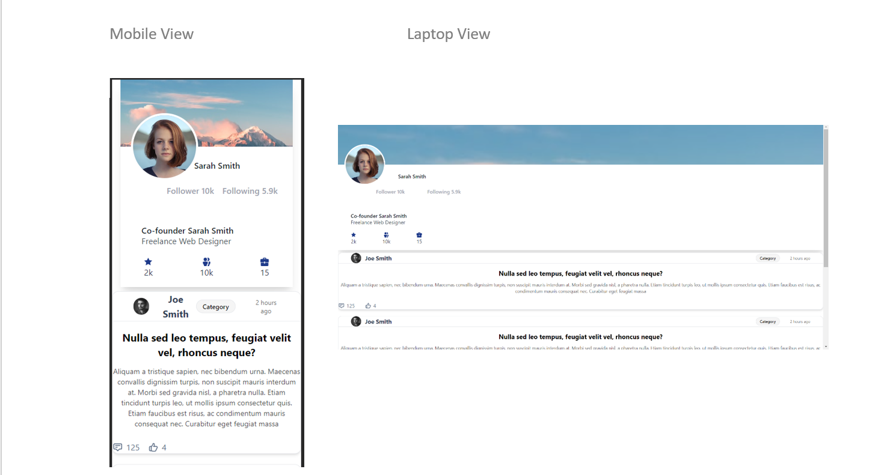

### ScreenShot 

### To Run this project: 
Node js version = v18.16.1
In the project directory, you can run:

Note:If you got error from create-react-app then install or skip this if you don't want to create new app:
 ### `npm install create-react-app`

 Go to your Project Directory:
Enter:
### `npm install`
### `npm install -D tailwindcss`
### `npx tailwindcss init`

Configure your template paths
Add the paths to all of your template files in your tailwind.config.js file.

/** @type {import('tailwindcss').Config} */
module.exports = {
  content: [
    "./src/**/*.{js,jsx,ts,tsx}",
  ],
  theme: {
    extend: {},
  },
  plugins: [],
}

# Start the server
### `npm start`

Runs the app in the development mode.\
Open [http://localhost:3000](http://localhost:3000) to view it in your browser.

The page will reload when you make changes.\
You may also see any lint errors in the console.

### `npm test`

Launches the test runner in the interactive watch mode.\
See the section about [running tests](https://facebook.github.io/create-react-app/docs/running-tests) for more information.

### `npm run build`

Builds the app for production to the `build` folder.\
It correctly bundles React in production mode and optimizes the build for the best performance.

The build is minified and the filenames include the hashes.\
Your app is ready to be deployed!

See the section about [deployment](https://facebook.github.io/create-react-app/docs/deployment) for more information.
